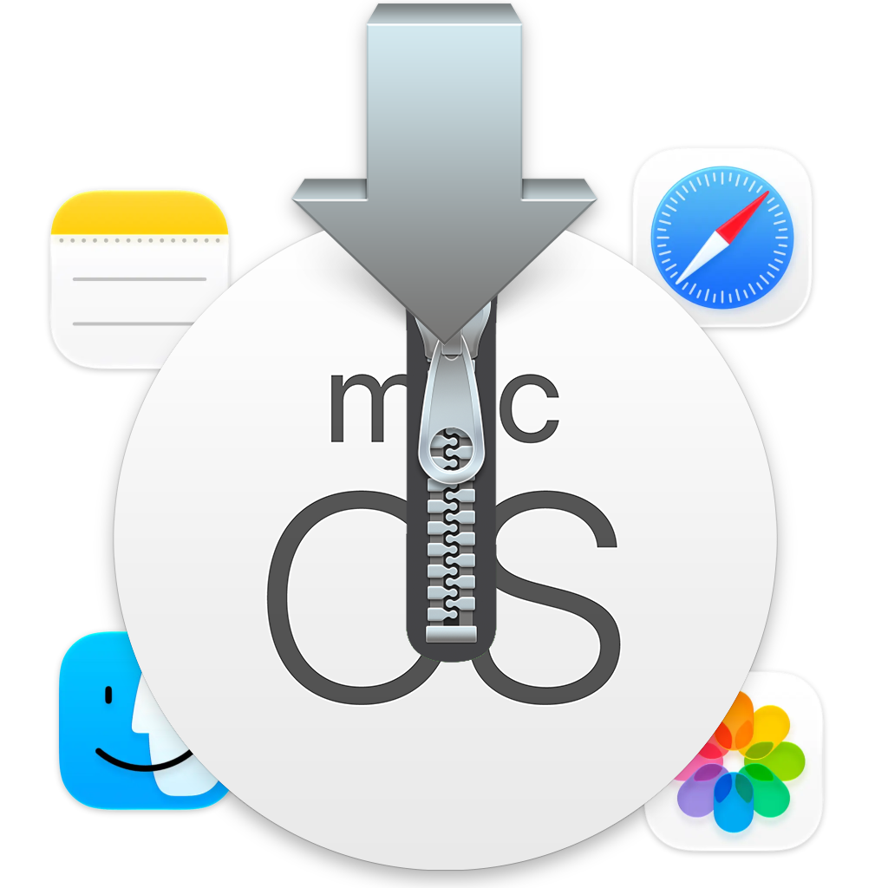

# Installer-Resource-Extractor

## Description

This project is designed to make getting macOS System files, for whatever reason (maybe for restoring support for older hardware) out without installing that version of macOS. This is for Big Sur+
please note: this project takes a while to execute.

NOTE: There is a known issue ([#4](https://github.com/gandolf243/Installer-Resource-Extractor/issues/4)) where the installer will fail half way through the extraction, most items should be usable. 

## Supported Installers

All installers Big Sur+ are supported, here is a list of tested ones. (if you have tested this program on an installer not checked bellow, please let me know [here](https://github.com/gandolf243/Installer-Resource-Extractor/discussions/1))

- [x] Big Sur 11

- [ ] Monterey 12

- [ ] Ventura 13

- [ ] Sonoma 14

- [ ] Sequoia 15

- [x] Tahoe 26

- [ ] Golden Gate 27

## Supported macOSes

This project has currently only been tested to run on macOS Sonoma. It most likely will work on way more. Please report [here](https://github.com/gandolf243/Installer-Resource-Extractor/discussions/1)

- [ ] Big Sur 11

- [ ] Monterey 12

- [ ] Ventura 13

- [x] Sonoma 14

- [ ] Sequoia 15

- [ ] Tahoe 26

- [ ] Golden Gate 27

## Important Links
* [FAQ](./FAQ.md)

## Credits

* [Nathanael Cain](https://github.com/gandolf243)
    * Project Creator and Researcher
    
* [Apple](https://apple.com)
    * [macOS](https://apple.com/macos)
    * PBZX
    * YAA1
